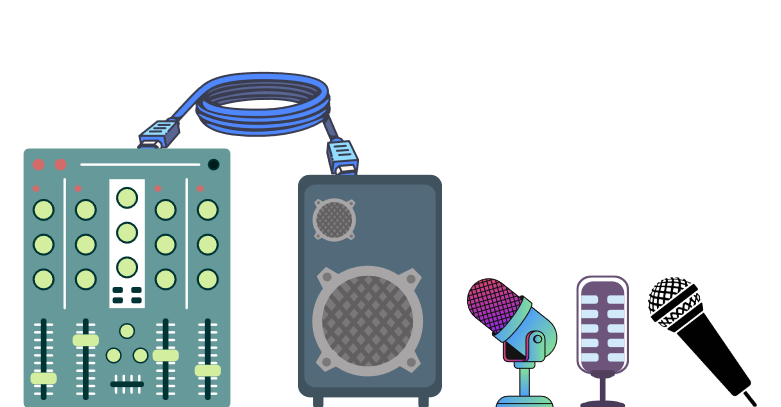
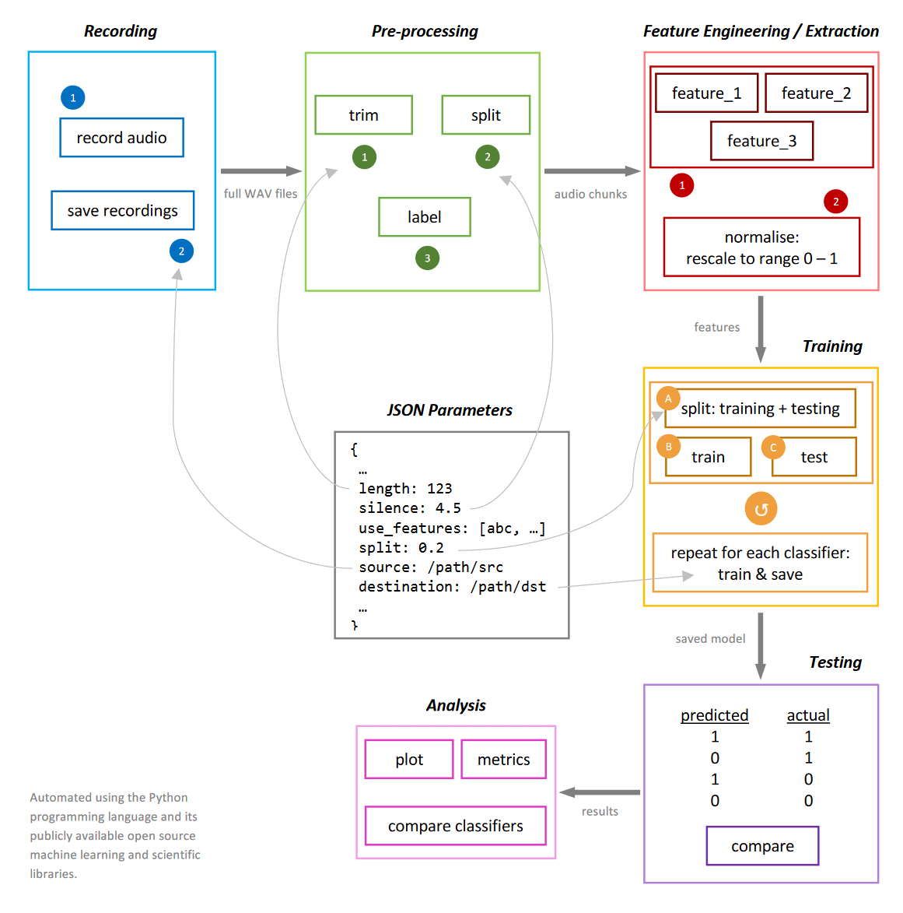

# Microphone Fingerprinting via Machine Learning

Part of my Master's thesis submission.

**NEW:** [Click here to access the simplified Jupyter Notebook.](Microphone_Fingerprinting.ipynb)

## Acknowledgements

I would like to thank Prof. Andreas Schaad and Prof. Janis Keuper for supervising my writing, Dominik Binder for dedicating his time to help me better understand the nuances of machine learning, and my friends and family for their never-ending patience. And lastly myself, for not giving up when the pressure caught up.

## Goals

The purpose of this experiment is to answer the following questions:

 - Is it possible to identify a microphone based on its audio recordings?
 - How to identify discrepancies in sound captured by two recording devices?
 - What could limit or hinder the ability to distinguish between them?
 - How does the presence of human speech, noise, or other types of sound affect the process?
 - What minimum length of audio recording is required for successful training?

[Click here for the full paper.](ml-based-mic-fingerprinting.pdf)

[Click here to view the poster.](poster.pdf)

## Project pipeline

## Code used

Python and its standard library, in addition to the following packages installed using `pip`:

 - librosa
 - matplotlib
 - numpy
 - pandas
 - pydub
 - scikit-learn

## Dataset

Kaggle link to the raw audio files in WAV format (zipped):

[https://www.kaggle.com/datasets/victorazzam/microphone-fingerprinting](https://www.kaggle.com/datasets/victorazzam/microphone-fingerprinting)

## Attribution

The sounds from which the audio recordings were made came from freely-available internet resources.

| Sound | Source | Link |
| ----- | ------ | -----|
| Swept Sine Wave - 20Hz-20kHz | Curt Taipale | [on churchsoundcheck.com](https://www.churchsoundcheck.com/audio-test-signals.html) |
| Jet Black Crayon - Scammon's Lagoon | Internet Archive | [on archive.org](https://archive.org/details/cd_low-frequency-speaker-test_jet-black-crayon) |
| JJD - Can't Say No | NoCopyrightSounds | [on ncs.io](http://ncs.io/CantSayNo) |
| Peter Pan (version 3 Dramatic Reading) | LibriVox | [on librivox.org](https://librivox.org/peter-pan-dramatic-reading-by-j-m-barrie) |
| Peter Pan (version 2) | LibriVox | [on librivox.org](https://librivox.org/peter-pan-version-2) |

The sounds were recorded by playing the sourced audio through a loudspeaker directly facing 5 microphones that were connected to a TASCAM Model 12 audio interface.

## License

**Code:** [GNU General Public License v2.0 (GPLv2)](https://choosealicense.com/licenses/gpl-2.0)

**Paper:** [Creative Commons — Attribution 4.0 International (CC BY 4.0)](https://creativecommons.org/licenses/by/4.0)
